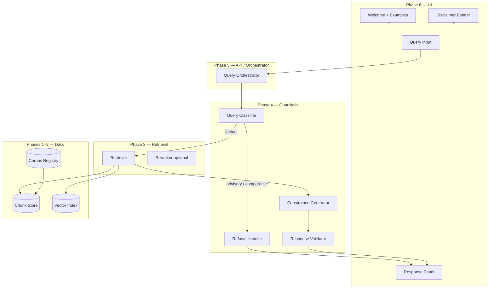
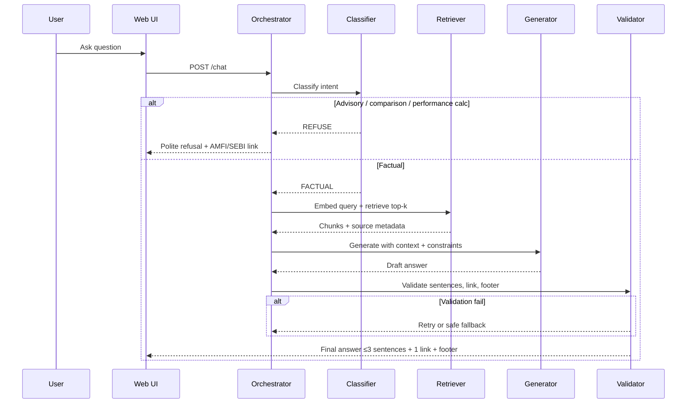
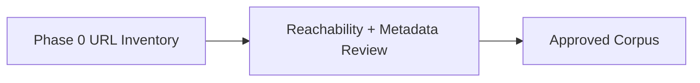
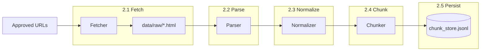
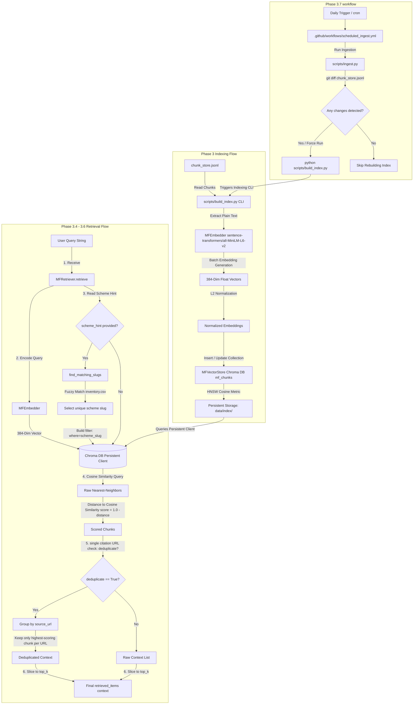
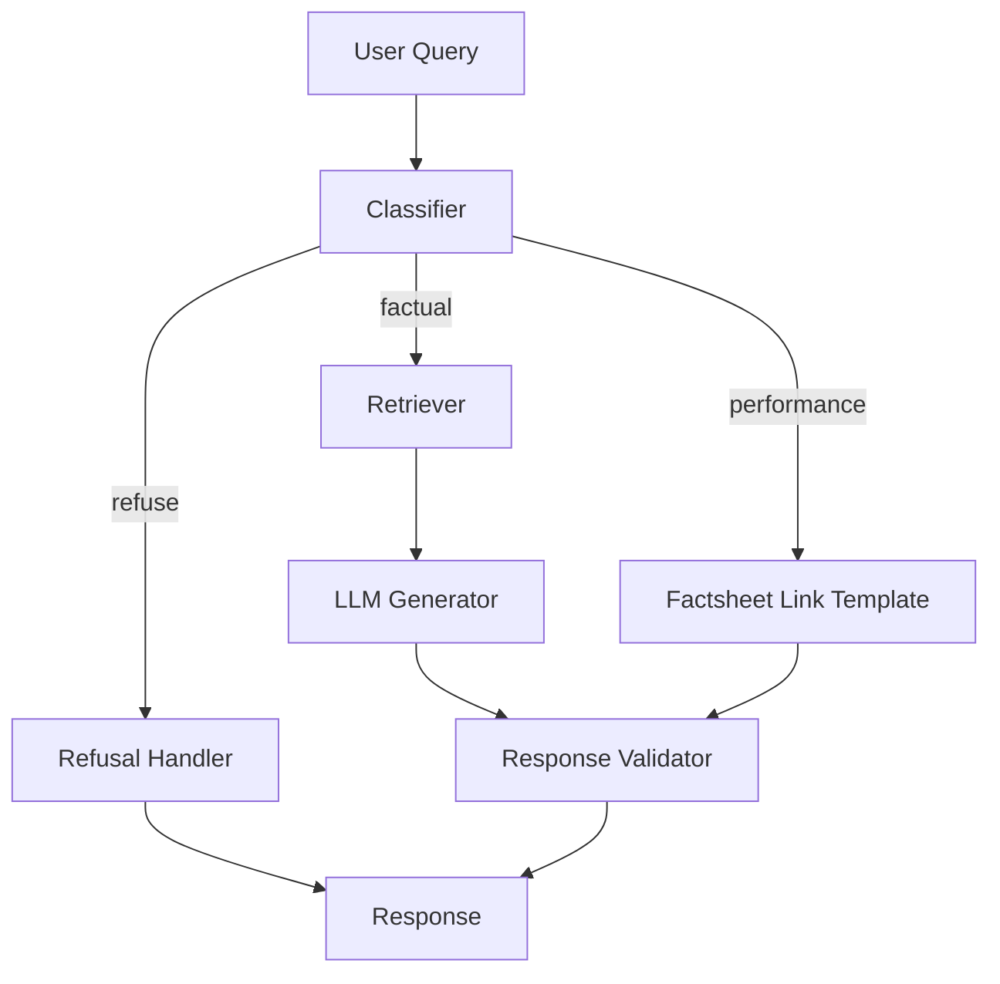
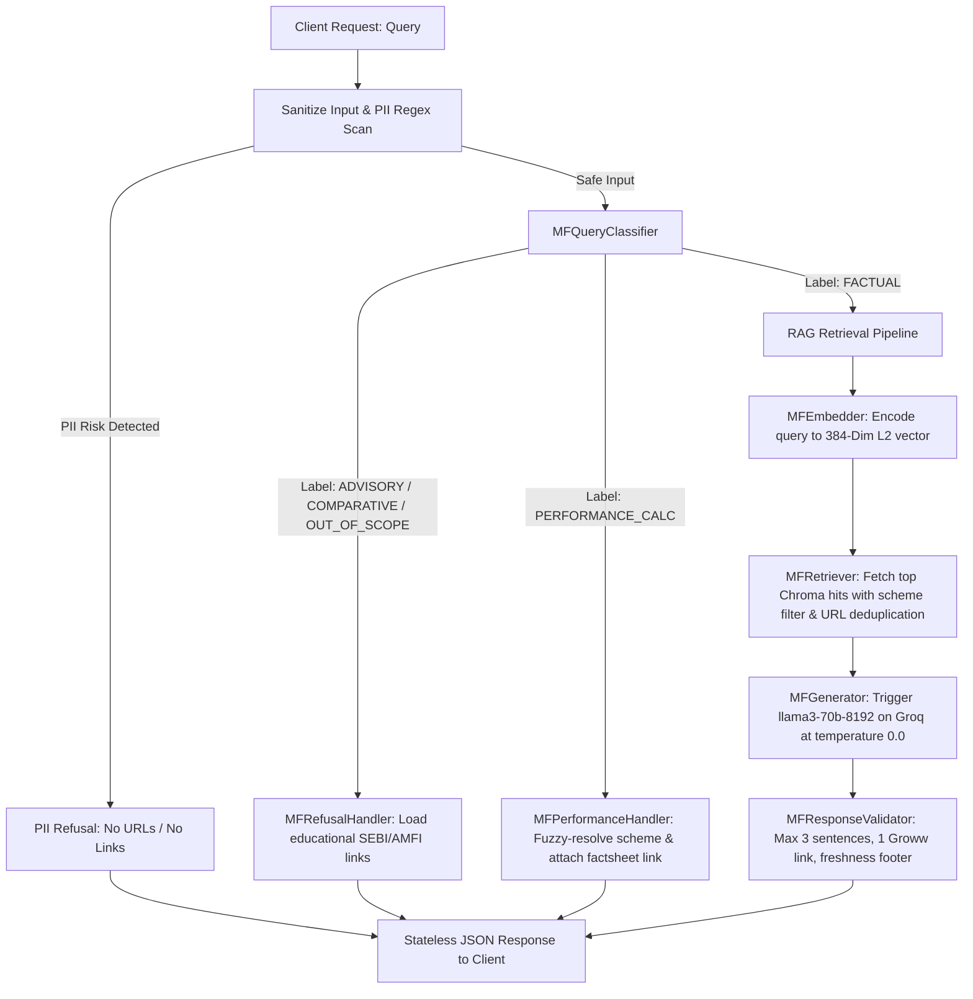
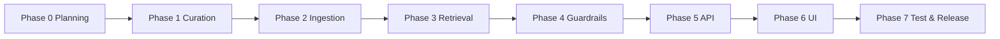

# Phase-Wise Architecture: Mutual Fund FAQ Assistant

This document defines the end-to-end architecture for the facts-only mutual fund FAQ assistant described in [ProblemStatement.md](./ProblemStatement.md). Each phase has goals, components, data flows, deliverables, and exit criteria.

---

## Table of Contents

1. [Architecture Principles](#architecture-principles)
2. [High-Level System View](#high-level-system-view)
3. [Phase Overview](#phase-overview)
4. [Phase 0 — Foundation & Planning](#phase-0--foundation--planning)
5. [Phase 1 — Corpus Curation](#phase-1--corpus-curation)
6. [Phase 2 — Ingestion & Document Store](#phase-2--ingestion--document-store)
7. [Phase 3 — Indexing & Retrieval (RAG Core)](#phase-3--indexing--retrieval-rag-core)
8. [Phase 4 — Generation, Guardrails & Refusal](#phase-4--generation-guardrails--refusal)
9. [Phase 5 — API & Orchestration Layer](#phase-5--api--orchestration-layer)
10. [Phase 6 — Minimal User Interface](#phase-6--minimal-user-interface)
11. [Phase 7 — Testing, Compliance Validation & Release](#phase-7--testing-compliance-validation--release)
12. [Cross-Cutting Concerns](#cross-cutting-concerns)
13. [Suggested Technology Stack](#suggested-technology-stack)
14. [Directory Layout (Reference)](#directory-layout-reference)
15. [Phase Edge Cases](./edge-cases/README.md)

---

## Architecture Principles

| Principle | Implication |
|-----------|-------------|
| **Closed corpus** | Ingestion, retrieval, and citations use **exactly 30 fixed Groww URLs** from Phase 0—no other pages, domains, or PDFs. |
| **Facts-only** | Retrieval and generation are constrained to that corpus; no open-web search. |
| **Source-backed** | Every factual answer cites exactly one URL from the closed inventory (same URL the chunk was ingested from). |
| **Compliance-first** | Advisory, comparative, and performance-calculation queries are blocked or redirected before or after generation. |
| **Accuracy over fluency** | Prefer abstention (“not found in sources”) over hallucinated facts. |
| **Privacy by design** | No PII fields in logs, prompts, or storage; stateless or ephemeral sessions only. |
| **Lightweight RAG** | Fixed 30-URL corpus, offline indexing, simple vector + metadata store. |

### Closed corpus policy (binding)

For **this project**, the knowledge base is **exhaustive and exclusive**:

| Rule | Detail |
|------|--------|
| **Allow** | Only the 30 URLs listed in [Phase 0 — Approved URL inventory](#approved-url-inventory-project-corpus) |
| **Deny** | Any URL not in that list—including other Groww scheme pages, AMC/AMFI/SEBI sites, PDFs, blogs, or aggregators |
| **Ingestion** | Fetcher must reject requests whose URL is not an exact match in `corpus/url_inventory.csv` |
| **Retrieval** | Index built only from chunks whose `source_url` is in the closed list |
| **Citations** | Validator rejects answers whose link is not one of the 30 inventory URLs |
| **Refusal links only** | AMFI/SEBI educational URLs may appear **only** in refusal templates—not in the RAG corpus |

No phase may add, substitute, or “discover” URLs. Expanding the corpus requires an explicit documentation change to Phase 0 and re-ingestion.

---

## High-Level System View



### Request lifecycle (factual query)



---

## Phase Overview

| Phase | Name | Primary output | Depends on |
|-------|------|----------------|------------|
| 0 | Foundation & Planning | ICICI Prudential + 30 Groww URLs locked, compliance rules | — |
| 1 | Corpus Curation | Validate and enrich Phase 0 URL metadata | Phase 0 |
| 2 | Ingestion & Document Store | Clean text chunks + source registry | Phase 1 |
| 3 | Indexing & Retrieval | Vector index + retrieval API | Phase 2 |
| 4 | Generation, Guardrails & Refusal | Safe answer + refusal pipelines | Phase 3 |
| 5 | API & Orchestration | `/chat` (or equivalent) backend | Phase 4 |
| 6 | Minimal UI | Groww-inspired chat surface | Phase 5 |
| 7 | Testing & Release | Test report, README, known limitations | Phases 0–6 |

**Edge cases:** Each phase has a dedicated catalog under [docs/edge-cases/](./edge-cases/README.md) for implementation and testing.

---

## Phase 0 — Foundation & Planning

### Goals

- Lock scope: **ICICI Prudential Mutual Fund** as the single AMC, with corpus pages on **Groww** (reference product context per problem statement).
- Use **only** the closed URL inventory below (29 scheme pages + 1 AMC filter page = **30 URLs**)—**no other URLs** for this project.
- Define document types, metadata schema, and refusal taxonomy.
- Align UX copy with Groww-style clarity.

### Locked scope

| Field | Value |
|-------|--------|
| **AMC** | ICICI Prudential Mutual Fund |
| **Corpus host** | `groww.in` (mutual fund scheme pages) |
| **Scheme pages** | 29 Direct Growth plan URLs |
| **Directory page** | 1 AMC filter listing |
| **Primary schemes for UI examples & golden tests** | Large Cap, Flexicap, Liquid (category diversity) |
| **Corpus policy** | **Closed** — exactly these 30 URLs; nothing else is ingested or cited |

### Approved URL inventory (project corpus)

This table is the **complete and final** corpus for MFChatBot. All URLs below are the **only** sources for Phase 2 ingestion, Phase 3 retrieval, and user-facing citations. Do not add AMC factsheets, AMFI/SEBI pages, or other Groww scheme URLs unless this table is formally updated.

Citations must use the same `source_url` as the chunk’s originating page (an exact match to one row below).

| # | Scheme / page | Category (planning) | URL |
|---|---------------|---------------------|-----|
| 1 | ICICI Prudential Silver ETF FoF Direct Growth | Commodity / FoF | https://groww.in/mutual-funds/icici-prudential-silver-etf-fof-direct-growth |
| 2 | ICICI Prudential Bharat 22 FoF Direct Growth | FoF / thematic | https://groww.in/mutual-funds/icici-prudential-bharat-22-fof-direct-growth |
| 3 | ICICI Prudential Large Cap Fund Direct Growth | Large cap | https://groww.in/mutual-funds/icici-prudential-large-cap-fund-direct-growth |
| 4 | ICICI Prudential Dynamic Plan Direct Growth | Dynamic asset allocation | https://groww.in/mutual-funds/icici-prudential-dynamic-plan-direct-growth |
| 5 | ICICI Prudential Technology Fund Direct Growth | Sectoral (technology) | https://groww.in/mutual-funds/icici-prudential-technology-fund-direct-growth |
| 6 | ICICI Prudential Pharma Healthcare and Diagnostics (P.H.D) Fund Direct Growth | Sectoral (pharma) | https://groww.in/mutual-funds/icici-prudential-pharma-healthcare-and-diagnostics-(p.h.d)-fund-direct-growth |
| 7 | ICICI Prudential Nifty Next 50 Index Fund Direct Growth | Index | https://groww.in/mutual-funds/icici-prudential-nifty-next-50-index-fund-direct-growth |
| 8 | ICICI Prudential Retirement Fund Hybrid Aggressive Plan Direct Growth | Hybrid / retirement | https://groww.in/mutual-funds/icici-prudential-retirement-fund-hybrid-aggressive-plan-direct-growth |
| 9 | ICICI Prudential — AMC listing (filter) | Directory | https://groww.in/mutual-funds/filter?fund_house=%5B%22ICICI+Prudential+Mutual+Fund%22%5D |
| 10 | ICICI Prudential Dividend Yield Equity Fund Direct Growth | Equity (dividend yield) | https://groww.in/mutual-funds/icici-prudential-dividend-yield-equity-fund-direct-growth |
| 11 | ICICI Prudential Regular Income Fund Direct Growth | Debt / income | https://groww.in/mutual-funds/icici-prudential-regular-i-come-fund-direct-growth |
| 12 | ICICI Prudential Nifty IT Index Fund Direct Growth | Index / sectoral | https://groww.in/mutual-funds/icici-prudential-nifty-it-index-fund-direct-growth |
| 13 | ICICI Prudential Multicap Fund Direct Growth | Multicap | https://groww.in/mutual-funds/icici-prudential-multicap-fund-direct-growth |
| 14 | ICICI Prudential Indo Asia Equity Fund Direct Growth | International equity | https://groww.in/mutual-funds/icici-prudential-indo-asia-equity-fund-direct-growth |
| 15 | ICICI Prudential Balanced Advantage Fund Direct Growth | Hybrid (balanced advantage) | https://groww.in/mutual-funds/icici-prudential-balanced-advantage-fund-direct-growth |
| 16 | ICICI Prudential Midcap Fund Direct Growth | Mid cap | https://groww.in/mutual-funds/icici-prudential-midcap-fund-direct-growth |
| 17 | ICICI Prudential Retirement Fund Pure Equity Plan Direct Growth | Retirement / equity | https://groww.in/mutual-funds/icici-prudential-retirement-fund-pure-equity-plan-direct-growth |
| 18 | ICICI Prudential Value Fund Direct Growth | Value | https://groww.in/mutual-funds/icici-prudential-value-direct-growth |
| 19 | ICICI Prudential Liquid Fund Direct Plan Growth | Liquid debt | https://groww.in/mutual-funds/icici-prudential-liquid-fund-direct-plan-growth |
| 20 | ICICI Prudential Short Term Plan Direct Growth | Short duration debt | https://groww.in/mutual-funds/icici-prudential-short-term-plan-direct-growth |
| 21 | ICICI Prudential Nifty Index Fund Direct Growth | Index (Nifty 50) | https://groww.in/mutual-funds/icici-prudential-nifty-index-fund-direct-growth |
| 22 | ICICI Prudential Flexicap Fund Direct Growth | Flexi cap | https://groww.in/mutual-funds/icici-prudential-flexicap-fund-direct-growth |
| 23 | ICICI Prudential Gold ETF FoF Direct Growth | Commodity / FoF | https://groww.in/mutual-funds/icici-prudential-gold-etf-fof-direct-growth |
| 24 | ICICI Prudential Infrastructure Fund Direct Growth | Sectoral (infrastructure) | https://groww.in/mutual-funds/icici-prudential-infrastructure-fund-direct-growth |
| 25 | ICICI Prudential Balanced Fund Direct Growth | Hybrid (balanced) | https://groww.in/mutual-funds/icici-prudential-balanced-direct-growth |
| 26 | ICICI Prudential Commodities Fund Direct Growth | Thematic (commodities) | https://groww.in/mutual-funds/icici-prudential-commodities-fund-direct-growth |
| 27 | ICICI Prudential Top 100 Fund Direct Growth | Large cap | https://groww.in/mutual-funds/icici-prudential-top-100-fund-direct-growth |
| 28 | ICICI Prudential Transportation and Logistics Fund Direct Growth | Sectoral | https://groww.in/mutual-funds/icici-prudential-transportation-and-logistics-fund-direct-growth |
| 29 | ICICI Prudential Active Momentum Fund Direct Growth | Equity (momentum) | https://groww.in/mutual-funds/icici-prudential-active-momentum-fund-direct-growth |
| 30 | ICICI Prudential Aggressive Hybrid Active FoF Direct Growth | Hybrid / FoF | https://groww.in/mutual-funds/icici-prudential-aggressive-hybrid-active-fof-direct-growth |

**Ingestion guard (Phase 2):** Fetcher accepts a URL **only if** it matches a row in this table exactly (string equality after normalization). Domain-only allowlists are not sufficient—other Groww mutual-fund pages are **out of scope**.

**Suggested UI example questions (from locked schemes):**

1. What is the expense ratio of ICICI Prudential Large Cap Fund Direct Growth?
2. What is the minimum SIP amount for ICICI Prudential Flexicap Fund Direct Growth?
3. What is the exit load on ICICI Prudential Liquid Fund Direct Plan Growth?

### Components

| Component | Responsibility |
|-----------|----------------|
| **Scope registry** | AMC + 30 Groww URLs with scheme names and categories (table above) |
| **Compliance policy** | Allowed vs refused query types; performance-query handling (link to scheme page only) |
| **Metadata schema** | Fields attached to every chunk (see below) |

### Chunk metadata schema (canonical)

```yaml
source_url: string          # Groww scheme or listing URL from inventory above
source_type: enum           # scheme_page | amc_listing
amc: string                 # ICICI Prudential Mutual Fund
scheme_name: string | null  # null for AMC listing (#9)
scheme_slug: string | null  # e.g. icici-prudential-large-cap-fund-direct-growth
scheme_category: string | null
document_title: string
last_fetched_at: ISO-8601 date
content_hash: string        # For change detection on re-ingest
```

### Activities

1. ~~Select AMC and schemes~~ — **Done:** ICICI Prudential, 30 URLs locked above.
2. Export inventory to `corpus/url_inventory.csv` (columns: `#`, `scheme_name`, `category`, `url`, `source_type`, `status=approved`).
3. Define golden test set (10–15) spanning large cap, flexicap, liquid, index, and refusal cases.
4. Document refusal messages and educational fallback URLs (AMFI, SEBI)—for refusals only; **not** added to the RAG corpus.

### Deliverables

- `corpus/scope.yaml` — AMC, corpus host, primary example schemes
- `corpus/url_inventory.csv` — copy of table above with `status: approved`
- `docs/compliance-rules.md` (optional) — classifier labels

### Exit criteria

- [x] AMC and URL inventory fixed (30 Groww URLs, ICICI Prudential)
- [x] Closed corpus confirmed—no URLs beyond the inventory table
- [ ] `corpus/url_inventory.csv` generated from table above (exactly 30 rows, no extras)
- [ ] Refusal categories documented: advisory, comparison, performance calculation, out-of-scope
- [ ] Golden test queries drafted for at least Large Cap, Flexicap, and Liquid schemes

---

## Phase 1 — Corpus Curation

### Goals

Validate the **Phase 0 locked Groww URL inventory** (30 URLs) before ingestion: reachability, correct scheme mapping, and metadata completeness.

> **Note:** This project’s corpus is **only** the 30 Groww URLs in [Phase 0](#approved-url-inventory-project-corpus). Do not collect AMC factsheets, KIM/SID PDFs, AMFI/SEBI pages, or any other Groww scheme URLs.

### Components



| Component | Responsibility |
|-----------|----------------|
| **URL validator** | HTTP 200 check for all 30 Groww URLs; inventory row count = 30 |
| **Closed-list enforcer** | Reject any URL not in Phase 0 inventory (including other `groww.in` pages) |
| **Review checklist** | Page loads; scheme name matches slug; key facts visible (expense ratio, min SIP, exit load, riskometer) |

No additional URL categories or sources are in scope for this project—the Phase 0 table is the full corpus.

### Deliverables

- `corpus/url_inventory.csv` — **exactly 30 rows**, status `approved`, no extra URLs
- `corpus/sources.json` — same 30 URLs for ingestion (mirror of inventory)

### Exit criteria

- [ ] All 30 Phase 0 URLs reachable and marked `approved` in `corpus/url_inventory.csv`
- [ ] Inventory contains **exactly** 30 URLs—verified by count; no pending or supplemental URLs
- [ ] Metadata filled: `scheme_name`, `scheme_slug`, `scheme_category`, `source_type`
- [ ] `last_reviewed` date recorded per URL

---

## Phase 2 — Ingestion & Document Store

### Goals

Turn approved URLs into **clean, chunked text** with faithful metadata for retrieval and citation.

Implement **one subphase at a time** (2.1 → 2.6). Do not start the next subphase until the current subphase exit criteria pass.

### Subphase overview

| Subphase | Name | Primary output | Depends on |
|----------|------|----------------|------------|
| **2.1** | Closed-list fetch & raw cache | HTML files under `data/raw/` | Phase 1 |
| **2.2** | HTML parse | Structured text / sections per URL | 2.1 |
| **2.3** | Normalize & clean | Clean plain text per URL | 2.2 |
| **2.4** | Chunk & metadata | In-memory chunks with schema fields | 2.3 |
| **2.5** | Chunk store persist | `data/chunks/chunk_store.jsonl` | 2.4 |
| **2.6** | Orchestration & change detection | `scripts/ingest.py`, hashes, re-ingest | 2.5 |

### Components (full pipeline)

| Component | Responsibility | Subphase |
|-----------|----------------|----------|
| **Fetcher** | HTTP GET for HTML **only** for URLs in `corpus/url_inventory.csv` (exact match); abort on any other URL | 2.1 |
| **Raw cache** | Save reproducible HTML snapshot per inventory row | 2.1 |
| **Parser** | HTML → text/sections (e.g., readability, heading blocks); no external PDFs or off-list links | 2.2 |
| **Normalizer** | Strip nav/footer boilerplate; preserve tables where possible (expense ratio, exit load) | 2.3 |
| **Chunker** | Split by headings / token limit (e.g., 400–800 tokens, 10–15% overlap) | 2.4 |
| **Chunk store** | JSONL: chunk text + metadata | 2.5 |
| **Ingest orchestrator** | Run 2.1–2.5 for all 30 URLs; logging; idempotent rebuild | 2.6 |
| **Change detector** | `content_hash` per URL; compare on re-run | 2.6 |

### Data flow



### Design decisions

- **One citation URL per answer** = chunk’s `source_url` (page-level, not fragment).
- Store **raw fetch timestamp** as `last_fetched_at`; footer uses max date among chunks used in the answer.
- Do not persist user data; ingestion is batch/offline only.
- Each subphase must be **testable in isolation** (fixtures from prior subphase output).

---

### Phase 2.1 — Closed-list fetch & raw cache

**Goal:** Download HTML for exactly the 30 approved URLs and cache under `data/raw/`.

| Item | Detail |
|------|--------|
| **Input** | `corpus/url_inventory.csv` (status `approved`) |
| **Output** | `data/raw/{id}_{scheme_slug}.html` (or `{id}.html` for listing #9) |
| **Guard** | `enforce_closed_url()` before every GET; log and abort on violation |

**Tasks**

1. Implement fetcher using same HTTP policy as Phase 1 (User-Agent, retries, delay).
2. Verify final URL matches normalized inventory URL after redirects.
3. Write raw HTML + sidecar metadata (`fetch_status`, `last_fetched_at`).

**Deliverables**

- `src/ingestion/phase_2_1_fetch/fetcher.py`
- `scripts/ingestion/run_phase_2_1.py`
- `data/raw/` populated for 30 URLs

**Exit criteria**

- [ ] 30/30 HTML files present
- [ ] Zero fetches for URLs not in inventory
- [ ] Sidecar or log records `last_fetched_at` per id

---

### Phase 2.2 — HTML parse

**Goal:** Convert cached HTML into structured text (sections or single document) per URL.

| Item | Detail |
|------|--------|
| **Input** | `data/raw/*.html` |
| **Output** | `data/parsed/{id}.json` (sections + optional raw text length) |

**Tasks**

1. Parse Groww scheme page DOM (title, key fact blocks, body).
2. Do not follow or fetch linked URLs.
3. Handle listing page (#9) separately (fund list text only).

**Deliverables**

- `src/ingestion/phase_2_2_parse/parser.py`
- `scripts/ingestion/run_phase_2_2.py`
- `data/parsed/` (gitignored except fixtures for tests)

**Exit criteria**

- [ ] Parser runs on all 30 raw files without crash
- [ ] Non-empty text for each scheme page
- [ ] Listing page produces AMC-level text only

---

### Phase 2.3 — Normalize & clean

**Goal:** Remove boilerplate and normalize whitespace while keeping factual blocks.

| Item | Detail |
|------|--------|
| **Input** | `data/parsed/{id}.json` |
| **Output** | `data/normalized/{id}.txt` or `.json` |

**Tasks**

1. Strip nav, footer, cookie banners, duplicate whitespace.
2. Preserve labels for expense ratio, exit load, min SIP, riskometer where present.
3. Record `content_hash` of normalized text (SHA-256) for Phase 2.6.

**Deliverables**

- `src/ingestion/phase_2_3_normalize/normalizer.py`
- `scripts/ingestion/run_phase_2_3.py`
- `data/normalized/`

**Exit criteria**

- [ ] Normalized output non-empty for 30/30 URLs
- [ ] `content_hash` computed per URL
- [ ] Spot-check: “expense ratio”, “exit load”, “sip” still findable on Large Cap, Flexicap, Liquid

---

### Phase 2.4 — Chunk & attach metadata

**Goal:** Split normalized text into retrieval-sized chunks with canonical metadata.

| Item | Detail |
|------|--------|
| **Input** | Normalized text + `corpus/url_inventory.csv` row |
| **Output** | List of chunk dicts per URL (in memory or `data/chunks/draft/{id}.jsonl`) |

**Chunk metadata (required on every chunk)**

`source_url`, `source_type`, `amc`, `scheme_name`, `scheme_slug`, `scheme_category`, `document_title`, `last_fetched_at`, `content_hash`, `chunk_index`, `text`

**Tasks**

1. Chunk by heading boundaries first; fall back to token window (400–800 tokens, ~10–15% overlap).
2. Set `source_url` to inventory URL (page-level, no `#` fragment).
3. Cap excessive chunk count per page (merge small sections if needed).

**Deliverables**

- `src/ingestion/chunker.py`

**Exit criteria**

- [ ] Every chunk has all required metadata fields
- [ ] `source_url` values ⊆ closed inventory (30 URLs)
- [ ] At least one chunk per scheme page; listing page chunks use `scheme_name: null`

---

### Phase 2.5 — Persist chunk store

**Goal:** Write the full corpus to a single JSONL file for Phase 3 indexing.

| Item | Detail |
|------|--------|
| **Input** | Chunk lists from 2.4 |
| **Output** | `data/chunks/chunk_store.jsonl` |

**Tasks**

1. Append one JSON object per line; stable key ordering for diffs.
2. Validate row count and unique `source_url` set after write.
3. Reject write if any chunk references off-list URL.

**Deliverables**

- `src/ingestion/store.py`
- `data/chunks/chunk_store.jsonl`

**Exit criteria**

- [ ] `chunk_store.jsonl` exists and parses line-by-line
- [ ] Only inventory `source_url` values appear in file
- [ ] No empty `text` fields

---

### Phase 2.6 — Orchestration & change detection

**Goal:** Single entry point to run the pipeline and support re-ingest of the same 30 URLs.

| Item | Detail |
|------|--------|
| **Input** | `corpus/url_inventory.csv` |
| **Output** | Updated `chunk_store.jsonl`, ingest log, optional hash manifest |

**Tasks**

1. `scripts/ingest.py` — flags: `--id`, `--force`, `--skip-fetch` (reuse raw), `--dry-run`.
2. Compare `content_hash` to `corpus/ingest_manifest.json` (new); skip unchanged unless `--force`.
3. Structured log: per-id status, chunk count, errors; zero off-list fetches.
4. **Automation Scheduler**: Build a daily GitHub Actions workflow to auto-run ingestion and commit updates to the repository when changes are detected.

**Deliverables**

- `scripts/ingest.py` (wired to 2.1–2.5)
- `corpus/ingest_manifest.json` (optional: `url`, `content_hash`, `last_fetched_at`)
- `.github/workflows/scheduled_ingest.yml` (automation workflow)

**Exit criteria**

- [ ] Full ingest completes for 30/30 URLs
- [ ] Re-run detects unchanged hash (no-op or skip)
- [ ] Re-run with changed HTML updates chunks and `last_fetched_at`
- [ ] Ingest is automatable via GitHub Actions trigger

---

### Phase 2 — Deliverables (complete)

| Artifact | Subphase |
|----------|----------|
| `data/raw/` | 2.1 |
| `data/parsed/`, `data/normalized/` (optional intermediates) | 2.2–2.3 |
| `data/chunks/chunk_store.jsonl` | 2.5 |
| `scripts/ingest.py` | 2.6 |
| `src/ingestion/phase_2_*` (`phase_2_1_fetch` … `phase_2_6_orchestrate`) | 2.1–2.6 |

### Phase 2 — Exit criteria (complete)

- [ ] Subphases 2.1–2.6 exit criteria all satisfied
- [ ] All **30** inventory URLs ingested—no extra URLs in `chunk_store.jsonl`
- [ ] Ingestion logs confirm zero fetches outside the closed list
- [ ] Spot-check: expense ratio, exit load, min SIP present in chunks for Large Cap, Flexicap, Liquid
- [ ] Every chunk has non-empty `source_url` and `source_type`

---

**Why embeddings & vector DB belong to Phase 3:**
- Phase 2 focuses on *data acquisition* – fetching, parsing, normalising and chunking the closed‑list URLs into plain text chunks stored in `chunk_store.jsonl`. This stage must be deterministic, audit‑able and inexpensive, so it runs daily with a cheap CI job.
- Converting those chunks into dense vectors is a *different computational concern* (embedding models, GPU/CPU load) and introduces a separate artefact (`data/index/`). It is only needed for semantic search, therefore we isolate it in Phase 3.
- The separation enables **idempotent change‑detection**: Phase 2 can skip work when `content_hash` is unchanged, while Phase 3 can rebuild the index only when a hash change occurs, avoiding unnecessary embedding calls.
- This modular design keeps the ingestion pipeline lightweight and makes the vector‑store step optional (e.g., you could run Phase 3 only when you have a suitable embedding backend).

---

## Phase 3 — Indexing & Retrieval (RAG Core)

> [!NOTE]
> **Vector DB & Embeddings Storage**: This is the phase where the text chunks from the chunk store (`chunk_store.jsonl`) are converted into vector embeddings using an embedding model and stored in a vector database (such as Chroma, FAISS, or LanceDB) to enable semantic search.

### Goals

Enable semantic search over the chunk store with scheme-aware filtering.

### Phase 3 — Architectural Flowchart




---

### Phase 3.1 — Embedding Model Selection & Configuration
**Goal:** Establish a fast, accurate, local embedding generation utility.

> [!NOTE]
> **Embedding Model vs. Generator LLM**: In a RAG pipeline, we utilize two entirely distinct types of models. 
> 1. **The Embedding Model (Phase 3)**: A small, specialized model (e.g. `all-MiniLM-L6-v2`, ~120 MB) whose only job is to act as a **Librarian / Card Index**. It converts text chunks and query strings into numerical lists (embeddings) to enable semantic mathematical search. **It does not read queries or generate answers.**
> 2. **The Generator LLM (Phase 4)**: A large, generative model (e.g. Llama-3, GPT-4) whose only job is to act as an **Expert Writer / Analyst**. It reads the plain-text chunks fetched by Phase 3 and synthesizes a highly compliant, factual 3-sentence response.
> 
> In **Phase 3.1**, we are only choosing and configuring the **Librarian** (the Embedding Model), not the conversational LLM.

#### What does Selection & Configuration mean here?
- **Model Selection:** Choosing the optimal mathematical model trained to convert plain text sections into dense, high-dimensional vector arrays. For this project, we have chosen the **`sentence-transformers/all-MiniLM-L6-v2`** model.
- **Model Configuration:** Setting up execution parameters such as forcing local **CPU execution** for standard development environments, implementing **lazy-loading** (so heavy model parameters are only initialized in memory on demand), and enabling **L2 normalization** so that simple dot product calculations equal cosine similarity in retrieval queries.

#### Why is this highly correct and significant for this project?
1. **Right-Sized for Small Corpus:** Our closed corpus is extremely small (30 Groww URLs producing about 117 plain text chunks, ~120 KB total size). A heavy, multi-gigabyte deep learning model is highly redundant and computationally wasteful.
2. **Zero Runtime Infrastructure Costs:** `all-MiniLM-L6-v2` is a tiny local model (~120 MB disk size). It runs locally on the CPU and requires no expensive GPU cloud nodes or API subscription fees (like OpenAI or Cohere).
3. **Exceptional Semantic Performance:** Despite its minimal footprint, it scores exceptionally well on retrieval tasks, easily linking synonyms like "exit load" to "redemption charge" or "SIP" to "recurring investment".
4. **Predictable Sub-Millisecond Latency:** Generates embeddings in 5–10ms per sentence on a single CPU core, satisfying the project’s strict retrieval response latency requirement (<2 seconds end-to-end).
5. **No External Dependencies (Offline Mode):** Execution is 100% local, keeping user financial queries secure and robust against external API downtimes.

- **Deliverables:** `src/retrieval/embedder.py` helper module.
- **Exit Criteria:** Local test verifies sentence conversion to standard float arrays of length 384 under 50ms latency.

### Phase 3.2 — Vector Database Configuration & Initialization
**Goal:** Initialize the database container with complete metadata schema.
- **Specification:** Local Chroma DB PersistentClient configured under `data/index/` using the `mf_chunks` collection name.
- **Deliverables:** `src/retrieval/store.py` (database client manager).
- **Exit Criteria:** Successful initialization of the client and validation of directory creation at `data/index/`.

### Phase 3.3 — Index Builder CLI (`scripts/build_index.py`)
**Goal:** Offline batch indexing job to compile database.
- **Input:** `data/chunks/chunk_store.jsonl`
- **Output:** Populated persistent vector DB under `data/index/`.
- **Tasks:**
  1. Load chunks from chunk store.
  2. Embed texts in batches (batch size = 64) with progress indication.
  3. Recreate the collection (wiping legacy data for reproducibility).
  4. Write text and metadata schemas (`source_url`, `source_type`, `amc`, `scheme_name`, `scheme_slug`, `scheme_category`, `document_title`, `last_fetched_at`, `content_hash`, `chunk_index`).
- **Deliverables:** `scripts/build_index.py` CLI script.
- **Exit Criteria:** Running `python scripts/build_index.py` successfully populates database files without error.

### Phase 3.4 — Basic Semantic Retriever API
**Goal:** Expose core Top-k vector nearest-neighbor retrieval.
- **Input:** Query string and `top_k` parameter.
- **Output:** List of parsed dictionary items matching `source_url`, `text` and calculated similarity scores.
- **Deliverables:** `src/retrieval/retriever.py` with standard `retrieve(query: str, top_k: int) -> list[dict]` interface.
- **Exit Criteria:** Vector query retrieves semantically matching chunks in top outcomes.

### Phase 3.5 — Metadata-Aware Retrieval Filtering
**Goal:** Scheme-specific segment extraction to prevent cross-fund context pollution.
- **Input:** Query string and an optional `scheme_hint` (scheme name or scheme slug).
- **Output:** Cosine similarity results filtered dynamically using metadata properties.
- **Deliverables:** Update `src/retrieval/retriever.py` to support `retrieve(..., scheme_hint=...)` with metadata constraints.
- **Exit Criteria:** Queries with `scheme_hint` filter out any matching chunks from other schemes.

### Phase 3.6 — Deduplication & Context Formatting
**Goal:** Context limit optimization and single citation URL compliance.
- **Input:** Raw retriever matches.
- **Output:** Deduplicated list of chunks returning the highest scoring chunk per `source_url`.
- **Tasks:** Group matching segments by `source_url`, keep the single highest-scoring chunk from each URL, and return the top 3-5 deduplicated chunks for downstream generator consumption.
- **Deliverables:** Update `src/retrieval/retriever.py` with deduplication filters.
- **Exit Criteria:** Retrieval results contain at most one chunk per unique `source_url`.

### Phase 3.7 — Automation Orchestrator Integration
**Goal:** Pipeline auto-rebuild hook on content changes.
- **Tasks:** Add step to `.github/workflows/scheduled_ingest.yml` to trigger `scripts/build_index.py` only if Phase 2 change detection detects modifications.
- **Exit Criteria:** Automated run executes and rebuilds the vector index if chunk files are written.

---

### Phase 3 — Deliverables (complete)

| Artifact | Subphase |
|----------|----------|
| `src/retrieval/embedder.py` | 3.1 |
| `data/index/` | 3.2 |
| `scripts/build_index.py` | 3.3 |
| `src/retrieval/retriever.py` | 3.4 - 3.6 |
| `.github/workflows/scheduled_ingest.yml` updates | 3.7 |

### Phase 3 — Exit criteria (complete)

- [x] Subphases 3.1–3.7 exit criteria all satisfied
- [x] Golden queries retrieve correct scheme's chunks in top-3
- [x] Index rebuild is 100% reproducible from `chunk_store.jsonl`
- [x] Cosine similarity results correctly return scores and metadata
- [x] Deduplication ensures at most one chunk per unique `source_url`
- [x] Latency is acceptable for demo (< 2s retrieval on CPU)


---

---

## Phase 4 — Generation, Guardrails & Refusal

### Goals

Produce **compliant answers**: ≤3 sentences, exactly one link, footer date; refuse or deflect everything else.

### Subsystems

#### 4.1 Query classifier

| Label | Examples | Action |
|-------|----------|--------|
| `FACTUAL` | “What is the expense ratio of Fund X?” | Retrieve + generate |
| `ADVISORY` | “Should I invest?” | Refusal |
| `COMPARATIVE` | “Which fund is better?” | Refusal |
| `PERFORMANCE_CALC` | “What will 10k become in 5 years?” | Factsheet link only, no numbers |
| `OUT_OF_SCOPE` | Unrelated topic | Refusal + educational link |
| `PII_RISK` | PAN, account, OTP in message | Block + generic privacy message (Strictly NO URLs/Links in response) |

Implementation options (combine for robustness):

- **Rule-based** — regex / keyword lists for advisory phrases
- **LLM classifier** — single-label JSON with low temperature
- **Performance detector** — “returns”, “CAGR”, “better than”, “vs” patterns

#### 4.2 Refusal handler

Template structure:

1. Polite acknowledgment
2. Facts-only limitation (one sentence)
3. One educational link (AMFI investor awareness or SEBI mutual funds page) - *Note: PII risk refusals and unknown queries must strictly NOT include any URL.*

No scheme-specific advice in refusals.

#### 4.3 Constrained generator

**Prompt contract:**

- Use **only** provided context chunks; if insufficient, say information is not in the approved sources.
- Maximum **3 sentences**.
- Include **one** markdown or plain URL — must equal `source_url` of the primary chunk used.
- Do not compare funds, recommend, or project returns.

**Post-generation validator**

| Check | On failure |
|-------|------------|
| Sentence count ≤ 3 | Truncate or regenerate |
| Exactly one URL present | Regenerate or attach retriever’s top `source_url` |
| URL ∈ closed inventory (exact match to one of 30) | Strip invalid links; do not substitute AMFI/SEBI/AMC URLs |
| No advisory phrases in output | Replace with refusal template |
| Footer present | Append `Last updated from sources: YYYY-MM-DD` |

Footer date = `max(last_fetched_at)` of chunks used in generation.

#### 4.4 Performance-query path

Do **not** run numeric performance reasoning. Return a fixed template:

- One sentence: performance details are on the scheme’s Groww page.
- One link: matching scheme `source_url` from the closed 30-URL inventory.
- Footer date as usual.

### Component diagram



### Deliverables

- `src/guardrails/classifier.py`
- `src/guardrails/refusal.py`
- `src/guardrails/validator.py`
- `src/generation/prompts.py`
- `config/refusal_templates.yaml`
- `config/educational_links.yaml`

### Exit criteria

- [ ] 100% of advisory/comparative golden queries → refusal with educational link
- [ ] 100% of factual golden queries → ≤3 sentences, one valid corpus URL, footer
- [ ] Performance golden queries → factsheet link only, no calculated returns

---

## Phase 5 — API & Orchestration Layer

### Goals & Overview
Phase 5 is the core **Backend** of the MFChatBot. Its purpose is to expose a stateless, secure, and compliant web API that links the entire conversational lifecycle (PII detection, intent classification, vector database retrieval, semantic chunk filtering, constrained LLM completion, and post-generation validation) into a single atomic transactional pipeline.

By building Phase 5 immediately after Phase 4, we establish a robust backend microservice. Once this API is fully tested and verified against the golden dataset, we will proceed to Phase 6 to build the responsive, modern frontend UI that consumes these endpoints.

### Stateless Pipeline Branching Logic
When a client sends a message to the backend via `POST /api/chat`, the request executes the following sequential pipeline logic:



1. **PII Risk / Security Sweep**: The query is run through `MFQueryClassifier.detect_pii_risk`. If PII matches (Aadhaar, PAN, phone, email, OTPs), it immediately triggers a strict PII refusal with **strictly no links** and halts. No logs of PII are persisted on the server.
2. **Intent Classification**: Safe inputs are classified by the hybrid classifier.
   - **Deflection Branch**: If labeled `ADVISORY`, `COMPARATIVE`, or `OUT_OF_SCOPE`, it bypasses RAG retrieval and returns the formatted SEBI/AMFI advisory template deflection.
   - **Performance Branch**: If labeled `PERFORMANCE_CALC`, it fuzzy-matches unique keywords to the closed corpus CSV inventory to resolve the correct Groww scheme page. It generates a single deflection link with standard footer date.
   - **Factual Branch**: If labeled `FACTUAL`, it proceeds to the vector retrieval pipeline.
3. **Factual RAG Pipeline**:
   - Converts the query into a normalized embedding via `MFEmbedder`.
   - Retrieves nearest-neighbors from Chroma DB.
   - Applies metadata filters (`where={"scheme_slug": slugs}`) to prevent cross-fund leakage if scheme keywords are present.
   - Applies single citation URL deduplication.
   - Synthesizes the facts-only answer using `MFGenerator` (Groq `llama3-70b-8192`) and cleans it using the `MFResponseValidator` (max 3 sentences, 1 valid Groww URL citation, data freshness footer).

### Stateless API Policy
The backend is completely stateless:
* **No Database Storage**: Does not persist conversations, chat history, or session state on disk.
* **No User Accounts**: Handles requests independently.
* **Secure Logging**: Logs metadata (query SHA-256 hash, intent classification, vector similarity scores, pipeline latency) but **never** logs raw query text or private credentials.

### API Endpoints

| Method | Path | Request Body | Response Body | Description |
|--------|------|--------------|---------------|-------------|
| `POST` | `/api/chat` | `{"query": "string"}` | `{"answer": "string", "source_url": "string", "intent": "string", "last_updated": "string"}` | Executes the main conversational orchestrator pipeline. |
| `GET` | `/api/examples` | None | `[{"label": "string", "query": "string"}]` | Exposes pre-defined compliance-safe example chips for UI bootstrapping. |
| `GET` | `/api/health` | None | `{"status": "ok", "timestamp": "string"}` | Standard health-check endpoint for server liveness. |

### Deliverables
* `src/orchestrator/pipeline.py`: Pure Python core pipeline orchestrating classifier, retriever, performance, and generator.
* `src/api/main.py`: FastAPI server exposing `/api/chat`, `/api/examples`, and `/api/health` endpoints with proper CORS handling.

### Exit criteria

- [ ] `/api/chat` satisfies response contract for all golden tests
- [ ] No PII persisted in server logs
- [ ] Stateless API (no user accounts)

---

## Phase 6 — Minimal User Interface

### Goals

Groww-inspired **minimal** chat UI meeting problem-statement UX requirements.

### UI components

| Element | Requirement |
|---------|-------------|
| **Disclaimer** | Persistent: “Facts-only. No investment advice.” |
| **Welcome** | Short intro to facts-only scope |
| **Example chips** | Three clickable example questions from `/api/examples` |
| **Input** | Single text field + send |
| **Response** | Answer text, clickable source link, footer line |
| **Refusal styling** | Distinct but not alarming (neutral tone) |

### Wireframe (logical)

```
┌─────────────────────────────────────────────┐
│  Facts-only. No investment advice.          │
├─────────────────────────────────────────────┤
│  Welcome: Ask factual questions about …     │
│  [Example 1] [Example 2] [Example 3]        │
├─────────────────────────────────────────────┤
│  Chat history (user / assistant bubbles)    │
├─────────────────────────────────────────────┤
│  [ Type your question...          ] [Send]  │
└─────────────────────────────────────────────┘
```

### Frontend ↔ API

- Call `POST /api/chat` on send.
- Render `source_url` as single primary link.
- Display `last_updated` in footer line verbatim.

### Frontend Deployment Plan (Vercel)

#### Objective

Deploy Phase 6 UI as a static Vercel app and proxy API requests to the Railway-hosted backend.

#### Deployment architecture

1. Vercel serves static assets from `frontend/`.
2. Frontend sends requests to `/api/*` in production.
3. `frontend/vercel.json` rewrites `/api/*` to Railway backend `/api/*`.
4. Local development continues to call `http://127.0.0.1:8000/api`.

#### Required frontend configuration

- `frontend/app.js`
  - Local hostnames (`localhost`, `127.0.0.1`) -> `http://127.0.0.1:8000/api`
  - Non-local (Vercel) -> `/api`
- `frontend/vercel.json`
  - Rewrite rule from `/api/(.*)` to `https://<RAILWAY_BACKEND_DOMAIN>/api/$1`
- `frontend/README.md`
  - Deployment steps and placeholder replacement instructions

#### Vercel setup steps

1. Create/import project in Vercel from this repository.
2. Set **Root Directory** to `frontend`.
3. Framework preset: **Other** (static site).
4. Build command: *(none)*.
5. Output directory: *(none)*.
6. Update `frontend/vercel.json` by replacing `REPLACE_WITH_RAILWAY_BACKEND_URL` with the Railway backend domain.
7. Deploy and verify:
   - `GET /` loads chat UI
   - `GET /api/health` returns backend health via rewrite
   - chat submission returns factual answer with source URL

#### Post-deploy validation checklist

- [ ] Disclaimer banner visible on load
- [ ] Example chips load from `/api/examples`
- [ ] `/api/chat` returns valid response
- [ ] Source link opens Groww page
- [ ] UI works on mobile viewport
- [ ] No CORS error in browser console

### Deliverables

- `frontend/` or `ui/` — static HTML+JS or lightweight React/Vite
- Disclaimer snippet reusable in README
- `frontend/vercel.json` — Vercel API rewrite/proxy config for Railway backend

### Exit criteria

- [ ] Disclaimer always visible
- [ ] Three examples functional
- [ ] Mobile-friendly layout (basic responsive CSS)
- [ ] Frontend deployed on Vercel and successfully proxies `/api/*` to Railway

---

## Phase 7 — Testing, Compliance Validation & Release

### Goals

Prove success criteria from the problem statement before delivery.

### Test layers

| Layer | Focus |
|-------|--------|
| **Unit** | Chunker, classifier rules, validator sentence/URL counts |
| **Integration** | Ingest → index → retrieve pipeline |
| **Golden Q&A** | 10–15 factual + 5–8 refusal queries with expected behavior |
| **Compliance** | No advice/comparison in outputs; performance → factsheet only |
| **Manual UAT** | UI walkthrough with target-user scenarios |

### Golden test matrix (sample)

| ID | Query type | Expected |
|----|------------|----------|
| G01 | Expense ratio | Factual + scheme factsheet link |
| G02 | Exit load | Factual + KIM/factsheet link |
| G03 | ELSS lock-in | Factual + regulatory or SID link |
| G04 | Should I invest? | Refusal + AMFI/SEBI link |
| G05 | Which fund is better? | Refusal |
| G06 | 5-year return on 10k | Factsheet link only, no calculation |

### Release artifacts

- **README** — setup, AMC/schemes, architecture summary, limitations
- **Disclaimer** — `Facts-only. No investment advice.`
- Known limitations — stale factsheets, PDF table parsing gaps, scheme name ambiguity

### Exit criteria (maps to problem statement success criteria)

- [ ] Accurate retrieval on golden factual set
- [ ] Strict facts-only responses
- [ ] Valid single citation on every factual answer
- [ ] Correct refusal of advisory queries
- [ ] Clean minimal UI

---

## Cross-Cutting Concerns

### Security & privacy

- No collection of PAN, Aadhaar, account numbers, OTP, email, or phone.
- Input length limits; regex to detect PII patterns → block with generic message.
- HTTPS in production; secrets via environment variables only.

### Observability (lightweight)

- Log: timestamp, intent label, retrieval scores, validation outcome, latency.
- Do not log full user messages in production if policy requires minimization; hash instead.

### Re-ingestion & freshness

- Monthly or on-demand re-run of Phase 2 + Phase 3 to refresh the **same 30 URLs** (content may change; URL list does not).
- Footer date reflects latest fetch, not answer generation time.

### Known limitations (document in README)

- HTML parsing may miss dynamic sections on Groww pages.
- Scheme name aliases need synonym map to the 30 locked scheme names.
- Cannot answer facts absent from the **30 URL** closed corpus.
- Questions about schemes or topics not covered by those 30 pages should abstain or refuse—not pull from other sites.

---

## Suggested Technology Stack

| Layer | Option A (simple) | Option B (scalable demo) |
|-------|-------------------|---------------------------|
| Language | Python 3.11+ | Same |
| API | FastAPI | FastAPI + Uvicorn |
| Vector store | Chroma (local) | FAISS + JSON metadata |
| Embeddings | `sentence-transformers/all-MiniLM-L6-v2` | Same or API embeddings |
| LLM | OpenAI / Azure OpenAI with strict prompts | Local Llama via Ollama |
| UI | Static HTML + vanilla JS | React + Vite |
| Ingestion | `requests` + `beautifulsoup4` + `pymupdf` | Same |

Choose stack based on assignment constraints; architecture phases are **technology-agnostic**.

---

## Directory Layout (Reference)

```
MFChatBot/
├── corpus/
│   ├── scope.yaml
│   ├── url_inventory.csv
│   └── sources.json
├── data/
│   ├── raw/
│   ├── chunks/
│   │   └── chunk_store.jsonl
│   └── index/
├── config/
│   ├── refusal_templates.yaml
│   └── educational_links.yaml
├── scripts/
│   ├── ingest.py
│   └── build_index.py
├── src/
│   ├── ingestion/
│   ├── retrieval/
│   ├── guardrails/
│   ├── generation/
│   ├── orchestrator/
│   └── api/
├── frontend/
├── tests/
│   └── golden/
├── docs/
│   ├── ProblemStatement.md
│   ├── PhaseWiseArchitecture.md
│   └── edge-cases/
│       ├── README.md
│       └── Phase0-EdgeCases.md … Phase7-EdgeCases.md
└── README.md
```

---

## Phase Dependency Graph



---

## Summary

The system is a **linear pipeline** over a **closed set of 30 Groww URLs** → chunked store → vector retrieval → **classified** generation with hard validation → minimal UI. Compliance is enforced at **four layers**: closed URL inventory (Phase 0), reachability check (Phase 1), exact-list ingestion (Phase 2), and citation validator (Phase 4). No other URLs are used for this project unless Phase 0 is explicitly revised.
